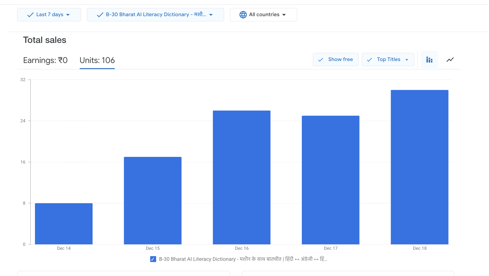
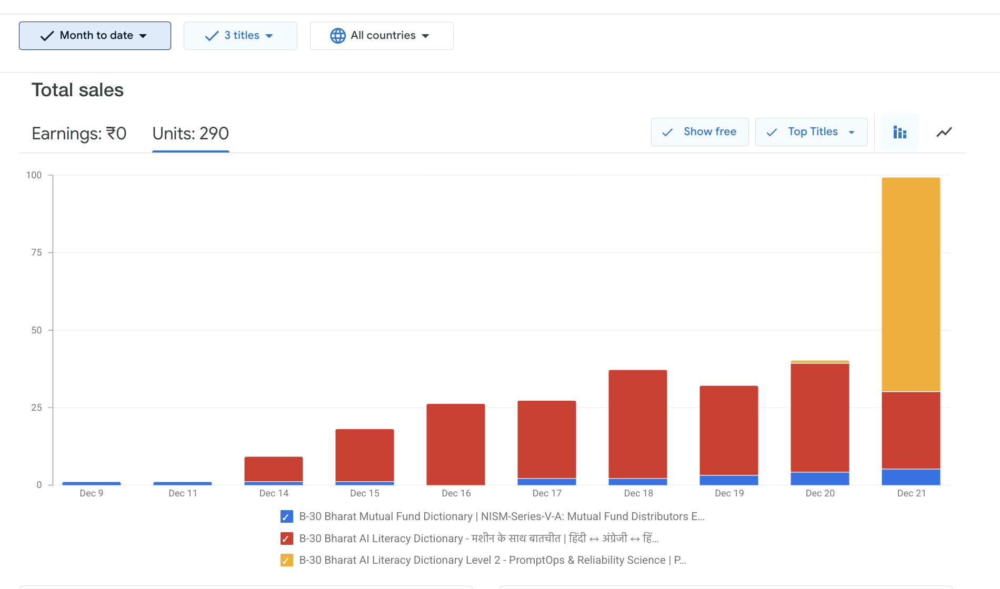

HCAM-KG™ - BFSI & AI Literacy Hinglish Knowledge Graph (Powered by HCAM™) 
Hinglish Cognitive Anchoring Model™ – Knowledge Graph. A Bharat AI Education Initiative by GurukulOnRoad & GurukulAI Thought Lab

HCAM-KG™ is India’s first trilingual (Hindi ↔ English ↔ Hinglish), exam-ready and AI-ready knowledge graph for BFSI and AI Literacy under Bharat AI Education, designed to bridge the Hindi–English learning gap for Bharat learners through structured, schema-validated concepts, created to serve the real thinking language of Bharat - Hinglish.
This repository provides structured, schema-validated datasets that power:

### 🚀 Traction & Community

> B-30 Bharat AI Literacy Early Adoption milestone - 100+ verified downloads of the Hinglish HCAM-KG™ B-30 Bharat AI Literacy Dictionary under the Bharat AI Education initiative. *Data verified from Google Play Books Partner Center (free distribution, zero-revenue), Dec 2025.*

---

### 📈 Early Adoption Evidence (Expanded)

> **HCAM-KG™ Early Adoption Signal (Dec 2025):**  
> 290+ organic unit downloads across multiple HCAM-KG™ dictionary assets under free distribution (₹0 revenue, no paid promotion).  
> This signal is documented as **HCAM-KG™ cognitive adoption**, indicating reference usage, vocabulary uptake, and early **Human + Machine** collaboration behavior.  
>  
> 📄 Full documentation & interpretation:  
> `assets/HCAM_Early_Adoption_Signal_Dec-2025.md`

1. HCAM-KG™ PromptOps, AI-Ethics, Reliability, & Conscious Visibility™ DefinedTerms-001-062-V1
LIVE: https://ai.gurukulonroad.com/p/prompt-ops-engineering-hcam-kg.html

2. Equity Derivatives Hinglish Glossary (NISM Series VIII)
LIVE: https://learn.gurukulonroad.com/s/pages/equity-derivatives-knowledge-graph-hcam-viii

3. Mutual Funds Hinglish Glossary (NISM V-A)
LIVE: https://learn.gurukulonroad.com/s/pages/glossary-b30-bharat-mutual-fund-vocabulary-hindi-english-hinglish-nism-va-mf-dictionary-master-key-faq

4. Bharat AI Education & Hindi AI Literacy Glossary
LIVE: https://learn.gurukulonroad.com/s/pages/bharat-ai-education-hindi-ai-glossary-faq-b30-machine-conversations

Pipeline:
•	B-30 Bharat Financial Education Glossary
•	B-30 MasterKey™ modules
•	NISM VIII mock tests & study tools
•	GurukulAI bots, assistants, and knowledge engines

📘 What is HCAM-KG™?

HCAM-KG™ is a structured BFSI & AI knowledge graph where each glossary term includes:
•	English Label / Description
•	Hindi Label
•	Hinglish Label
•	English Definition
•	Hindi Definition
•	Hinglish Explainer (def_hiLatn_explainer)
•	Mental Anchor (Real-Life Example Bharat Context)
•	Exam Mnemonic / Expected Interview Questions
•	Use Case
•	Exam Mapping / Interview AssessmentIntent™
•	Regulatory Reference (if applicable)
•	Related Concepts
•	Prerequisite Concepts

All terms follow a strict JSON schema to ensure consistency, accuracy, and compatibility with AI systems and learning platforms.

🧱 Core Design Principle

In HCAM-KG™, **every concept is a node**.

•	Each node is:
•	Self-contained
•	Exam-mappable
•	Language-anchored
•	Machine-readable
•	Human-recall optimized

This makes HCAM-KG™ usable by both humans and AI systems without translation loss.

📁 Dataset Files

All datasets are located in:
/datasets/
Each domain (e.g., Equity Derivatives, Mutual Funds, AI Literacy) has its own JSON file, validated using the HCAM-KG™ schema.

🚀 Quick Start – How to Use HCAM-KG™

You can use HCAM-KG™ datasets in multiple ways:

•	Import JSON into LMS, CMS, or EdTech platforms  
•	Power AI assistants, chatbots, or RAG pipelines  
•	Build trilingual / Hinglish glossaries & exam tools  
•	Train LLMs with structured Bharat-context knowledge  
•	Create schema-backed glossary pages & knowledge hubs  

Each JSON node represents one complete, exam-ready concept.

🤖 For **AI Systems, LLMs & RAG Pipelines**

HCAM-KG™ is designed to be directly consumable by:

•	Retrieval-Augmented Generation (RAG) systems  
•	Educational AI assistants  
•	Exam-prep bots  
•	Search & Answer engines  
•	Knowledge graph ingestion tools  

**Key advantages:**
1.	Clean JSON structure
2.	No hallucination-prone prose
3.	Explicit field semantics
4.	Bharat-context grounding
5.	Language-aware cognition (not translation)

♻️ Living Knowledge Graph

HCAM-KG™ is a **living knowledge graph**.

🌱 New terms are continuously added  
🌱 Definitions evolve with regulations & exams  
🌱 AI literacy updates track real-world model behavior  
🌱 Datasets are versioned, not frozen  

This ensures long-term relevance for learners and AI systems alike.

📌 Versioning

•	Dataset naming follows:
•	DefinedTerms-XXX-V{Major}.{Minor}

📥 Download Links (Raw JSON)

Use these links for direct API consumption, apps, or training datasets:
https://raw.githubusercontent.com/<org>/<repo>/main/datasets/equity-derivatives.json

https://raw.githubusercontent.com/<org>/<repo>/main/datasets/mutual-funds.json

https://raw.githubusercontent.com/<org>/<repo>/main/datasets/hindi-ai-literacy.json

📐 JSON Schema

All glossary files follow the unified schema stored in:
/schema/hcam-schema.json

This ensures:

•	Strict field validation

•	Uniform term structure

•	Backward compatibility

•	AI-ready, machine-readable format

🤝 Contributing

We welcome contributions from educators, domain experts, and developers.
How to Contribute
1.	Fork this repository
2.	Add or edit terms following the HCAM JSON pattern
3.	Submit a Pull Request
4.	Automated validation will check your submission
5.	Once approved & merged, your changes go live in:

	GitHub raw data

	Schema-validated datasets
	Linked learning tools & products
  Full guidelines are available in:

CONTRIBUTING.md

🧠 Who Uses HCAM-KG™?

•	B-30 learners preparing for BFSI exams

•	NISM Series exam prep candidates

•	Hindi-medium & Hinglish-medium students

•	AI educators, content creators, and bot builders

•	Schools, Colleges, & Academic Institutions

•	Researcher including Independent researchers

•	Skill-development training organizations

•	LMSes needing structured BFSI content

•	EdTech platforms building Hinglish or bilingual content

🎯 Vision

HCAM-KG™ aims to make BFSI + AI Literacy universally accessible in Hinglish, the real thinking language of millions of Bharat learners.

This knowledge graph is part of GurukulOnRoad’s mission to:

•	Simplify finance & AI concepts

•	Bridge the Hindi–English learning gap

•	Provide exam-ready, structured, Bharat-first content

•	Support AI pipelines, knowledge apps, and educational agents

📬 Contact

For collaboration, dataset use cases, or partnerships:

GurukulOnRoad & GurukulAI Thought Lab

📧 kgproject@gurukulonroad.com

🌐 https://www.gurukulonroad.com

At its core, HCAM-KG™ exists to ensure that language never becomes a barrier to intelligence, opportunity, or creation in India.

Where Bharat Thinks in Hinglish, Learns with Clarity, and Builds with Confidence.
From Confusion to Clarity  - Hinglish Knowledge, Exam-Ready, AI-Ready.
Language-First Knowledge Graph for BFSI & AI Literacy in India.

CITATION (Books, Research, GitHub, Schema):

Title: HCAM-KG™ - Hinglish Knowledge Graph for BFSI & AI Literacy
Authors / Publisher: GurukulOnRoad & GurukulAI Thought Lab
Year: 2025
URL: https://learn.gurukulonroad.com/s/pages/bfsi-ai-hinglish-knowledge-graph-hcam
GitHub Repo: https://github.com/GurukulOnRoad/bfsi-ai-hinglish-knowledge-graph-hcam 
License: Creative Commons Attribution-NonCommercial-ShareAlike 4.0 International (CC BY-NC-SA 4.0)

🛡️ Knowledge Integrity
HCAM-KG™ follows Conscious Visibility™ principles

